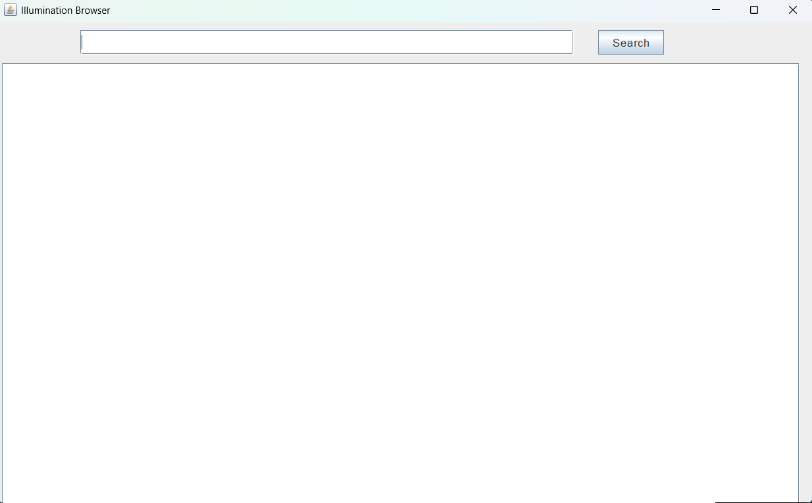
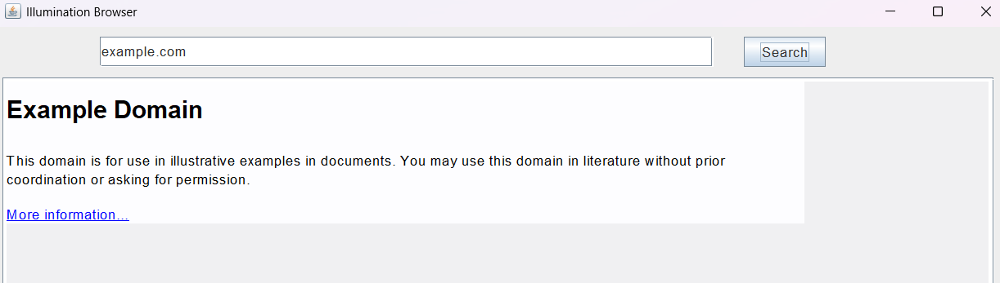

# Illumination Browser

## Overview

Illumination Browser is a lightweight web browser built with Java Swing. Designed with simplicity in mind, it allows users to enter a URL and display basic HTML page content in a clean and minimalistic interface. The browser supports:

- Basic HTML page viewing
- Enter the url to view page content 

Perfect for learning purposes or small-scale HTML content viewing!

---

## Requirements

- Java 8 or later

---

## Installation

1. Clone the repository:

```bash
git clone https://github.com/nikeshadhikari9/Simple_Web_Browser.git
```

2. Navigate to the project directory:

```bash
cd src
```

3. Run the program:

```bash
java Main
```

---

## Usage

1. Enter a URL in the search bar (e.g., https://example.com).
2. Click "Search" to load the webpage.
3. View the content displayed in the browser window.

---

## Screenshots

1. **Initial Browser Window**
   


2. **Loaded Page**
  

---

## Code Structure

- `Main.java`: Entry point of the application.
- `BrowserView.java`: Handles the User Interface.
- `BrowserController.java`: Responsible for fetching webpage content.

---
